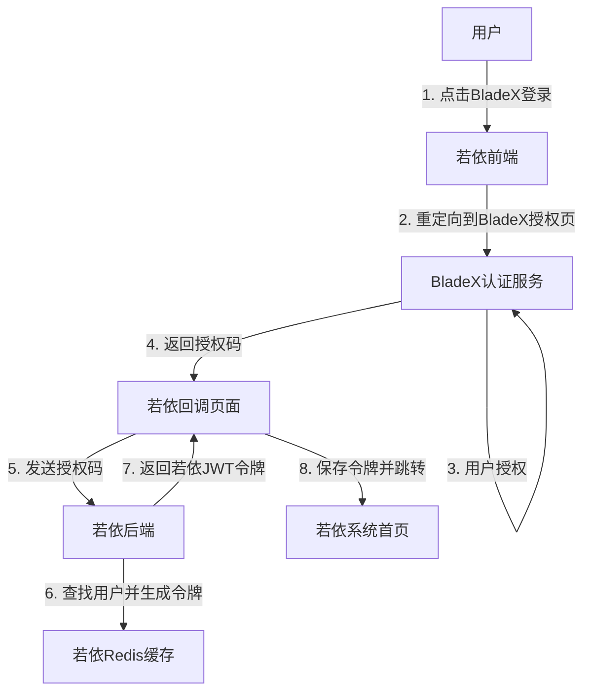

<p align="center">
	
</p>
<h1 align="center" style="margin: 30px 0 30px; font-weight: bold;">RuoYi v3.8.9</h1>
<h4 align="center">基于SpringBoot+Vue前后端分离的Java快速开发框架</h4>
<p align="center">
	<a href="https://gitee.com/y_project/RuoYi-Vue/stargazers"></a>
	<a href="https://gitee.com/y_project/RuoYi-Vue"></a>
	<a href="https://gitee.com/y_project/RuoYi-Vue/blob/master/LICENSE"></a>
</p>

## 平台简介

若依是一套全部开源的快速开发平台，毫无保留给个人及企业免费使用。

* 前端采用Vue、Element UI。
* 后端采用Spring Boot、Spring Security、Redis & Jwt。
* 权限认证使用Jwt，支持多终端认证系统。
* 支持加载动态权限菜单，多方式轻松权限控制。
* 高效率开发，使用代码生成器可以一键生成前后端代码。
* 提供了技术栈（[Vue3](https://v3.cn.vuejs.org) [Element Plus](https://element-plus.org/zh-CN) [Vite](https://cn.vitejs.dev)）版本[RuoYi-Vue3](https://gitcode.com/yangzongzhuan/RuoYi-Vue3)，保持同步更新。
* 提供了单应用版本[RuoYi-Vue-fast](https://gitcode.com/yangzongzhuan/RuoYi-Vue-fast)，Oracle版本[RuoYi-Vue-Oracle](https://gitcode.com/yangzongzhuan/RuoYi-Vue-Oracle)，保持同步更新。
* 不分离版本，请移步[RuoYi](https://gitee.com/y_project/RuoYi)，微服务版本，请移步[RuoYi-Cloud](https://gitee.com/y_project/RuoYi-Cloud)
* 阿里云折扣场：[点我进入](http://aly.ruoyi.vip)，腾讯云秒杀场：[点我进入](http://txy.ruoyi.vip)&nbsp;&nbsp;

## 内置功能

1.  用户管理：用户是系统操作者，该功能主要完成系统用户配置。
2.  部门管理：配置系统组织机构（公司、部门、小组），树结构展现支持数据权限。
3.  岗位管理：配置系统用户所属担任职务。
4.  菜单管理：配置系统菜单，操作权限，按钮权限标识等。
5.  角色管理：角色菜单权限分配、设置角色按机构进行数据范围权限划分。
6.  字典管理：对系统中经常使用的一些较为固定的数据进行维护。
7.  参数管理：对系统动态配置常用参数。
8.  通知公告：系统通知公告信息发布维护。
9.  操作日志：系统正常操作日志记录和查询；系统异常信息日志记录和查询。
10. 登录日志：系统登录日志记录查询包含登录异常。
11. 在线用户：当前系统中活跃用户状态监控。
12. 定时任务：在线（添加、修改、删除)任务调度包含执行结果日志。
13. 代码生成：前后端代码的生成（java、html、xml、sql）支持CRUD下载 。
14. 系统接口：根据业务代码自动生成相关的api接口文档。
15. 服务监控：监视当前系统CPU、内存、磁盘、堆栈等相关信息。
16. 缓存监控：对系统的缓存信息查询，命令统计等。
17. 在线构建器：拖动表单元素生成相应的HTML代码。
18. 连接池监视：监视当前系统数据库连接池状态，可进行分析SQL找出系统性能瓶颈。
19. BladeX单点登录：支持与BladeX系统集成，实现OAuth2.0单点登录，无缝对接外部认证系统。

## BladeX单点登录集成

本系统已与BladeX认证系统实现无缝集成，支持以下功能：

* 基于OAuth2.0授权码模式的单点登录流程
* 与若依原生登录机制完全兼容，保持相同的令牌结构和存储机制
* 前端提供BladeX登录入口，简化用户登录体验
* 自动同步用户信息，权限继承若依系统现有机制
* 完整的登录日志记录和异常处理

### 集成架构



### 配置说明

在`application.yml`中配置BladeX认证参数：

```yaml
# BladeX认证配置
blade:
  auth:
    # BladeX认证服务地址
    url: https://auth.example.com/oauth/token
    # 客户端ID
    client-id: your_client_id
    # 客户端密钥
    client-secret: your_client_secret
    # 重定向URI
    redirect-uri: http://your-app-url/auth/blade-callback
```
