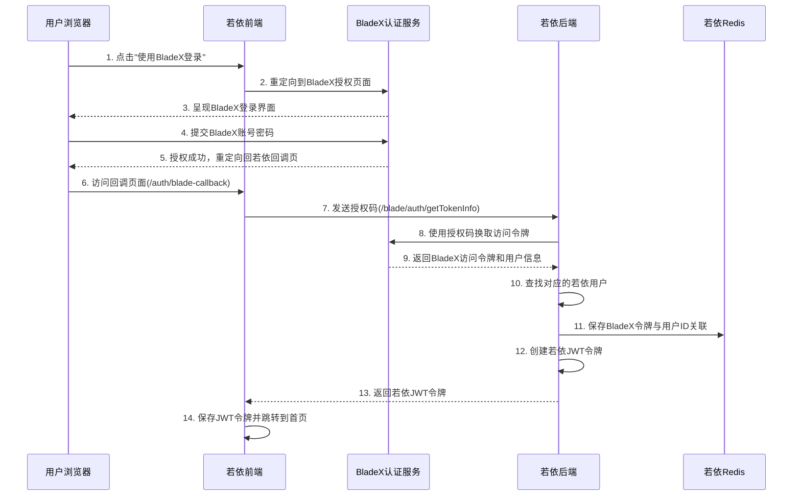
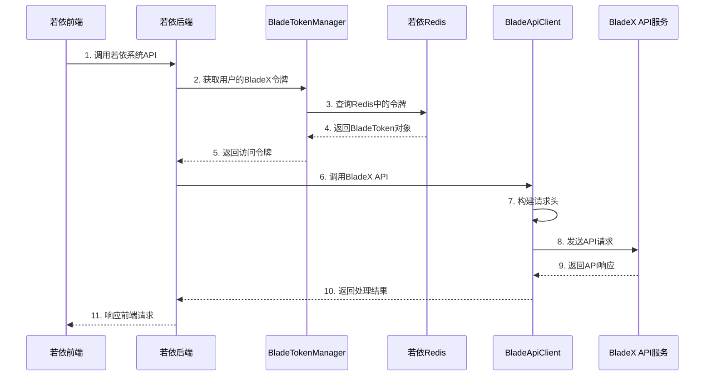

# BladeX单点登录与令牌管理流程

## 目录

1. [概述](#概述)
2. [系统架构](#系统架构)
3. [单点登录流程](#单点登录流程)
4. [令牌管理机制](#令牌管理机制)
5. [接口调用流程](#接口调用流程)
6. [关键代码实现](#关键代码实现)
7. [数据结构](#数据结构)
8. [安全性考虑](#安全性考虑)
9. [常见问题与解决](#常见问题与解决)

## 概述

本文档详细说明若依系统如何实现与BladeX的单点登录集成，包括令牌管理和接口调用的完整流程。整个集成采用基于OAuth2的授权码流程，允许用户通过BladeX账号登录若依系统，并使用BladeX令牌访问BladeX的各类API。

## 系统架构

整个单点登录与令牌管理系统主要包含以下组件：

### 前端组件
- `BladeCallback.vue`：处理BladeX认证回调的前端页面
- `/src/api/blade/apiTest.js`：BladeX API封装

### 后端服务
- `BladeAuthController`：处理BladeX认证回调和token获取
- `BladeApiController`：提供BladeX API代理接口
- `BladeTokenManager`：管理BladeX令牌的存储和检索
- `BladeApiClient`：调用BladeX API的客户端
- `BladeAuthUtil`：提供BladeX认证工具方法

### 数据存储
- Redis：存储BladeX令牌与若依用户ID的映射关系

## 单点登录流程



### 详细步骤

1. **发起BladeX授权**：用户在登录页点击"使用BladeX登录"按钮，前端将用户重定向到BladeX授权页面。

2. **BladeX认证**：用户在BladeX系统中完成登录和授权，BladeX认证服务生成授权码并重定向回若依系统的回调URL。

3. **处理授权回调**：
   - 前端：`BladeCallback.vue`组件接收授权码，并调用后端接口
   - 后端：`BladeAuthController.getTokenInfo`方法处理授权码

4. **获取BladeX令牌**：
   - `BladeAuthUtil.getTokenByCode`方法向BladeX认证服务发送请求，交换授权码获取访问令牌
   - 解析响应，获取访问令牌、过期时间、用户信息等

5. **查找对应若依用户**：
   - 根据BladeX返回的用户名(account)或username在若依系统中查找对应用户
   - 如未找到匹配用户，返回错误信息

6. **创建若依登录会话**：
   - 使用与原生登录完全相同的流程创建LoginUser对象
   - 记录登录IP和时间
   - 使用TokenService生成若依系统的JWT令牌
   - 保存登录状态到Redis

7. **保存BladeX令牌**：
   - 使用BladeTokenManager将BladeX访问令牌存入Redis
   - 将令牌与若依用户ID建立映射关系
   - 设置与BladeX令牌相同的过期时间

8. **返回登录结果**：
   - 前端接收若依JWT令牌并保存
   - 获取用户信息和路由
   - 跳转到系统首页

## 令牌管理机制

BladeX令牌的管理由`BladeTokenManager`类负责，主要功能包括：

1. **令牌保存**：
   - 将BladeX令牌信息封装为`BladeToken`对象存储在Redis中
   - 使用"blade_tokens:userId"作为Redis键名
   - 设置与BladeX原始令牌相同的过期时间

2. **令牌获取**：
   - 通过用户ID快速检索对应的BladeX令牌
   - 提供访问令牌（access_token）的便捷获取方法

3. **令牌验证**：
   - 检查用户是否拥有有效的BladeX令牌
   - 令牌自动随Redis过期机制失效

4. **令牌删除**：
   - 在用户登出或手动清除令牌时删除Redis中的对应记录

### 令牌数据结构

`BladeToken`类包含以下字段：
- `userId`：若依系统用户ID
- `userName`：用户名
- `accessToken`：BladeX访问令牌
- `loginTime`：令牌获取时间（毫秒时间戳）
- `expireTime`：令牌过期时间（毫秒时间戳）

## 接口调用流程



### 详细步骤

1. **前端发起请求**：
   - 前端调用若依系统API，例如`/blade/api/getUserInfo`

2. **获取BladeX令牌**：
   - `BladeApiController`从`SecurityUtils`获取当前登录用户ID
   - 调用`BladeTokenManager.getAccessToken(userId)`获取令牌

3. **构建API请求**：
   - `BladeApiClient`负责构建请求并添加必要的请求头
   - 添加"Blade-Auth: bearer {accessToken}"头
   - 添加Basic认证头用于API身份验证

4. **发送API请求**：
   - 使用RestTemplate发送HTTP请求到BladeX API
   - 处理各类响应和异常

5. **错误处理**：
   - 当遇到401未授权响应时，识别为令牌过期
   - 提示用户令牌已过期，需要重新登录

## 关键代码实现

### 保存BladeX令牌

```java
// BladeAuthController.java
String accessToken = (String) tokenInfo.get("access_token");
Integer expiresIn = (Integer) tokenInfo.get("expires_in");
if (accessToken != null && expiresIn != null) {
    bladeTokenManager.setBladeToken(user.getUserId(), user.getUserName(), accessToken, expiresIn);
    log.info("成功保存用户BladeX令牌, userId={}, expiresIn={}秒", user.getUserId(), expiresIn);
}
```

### 令牌保存实现

```java
// BladeTokenManager.java
public void setBladeToken(Long userId, String userName, String accessToken, int expiresIn) {
    BladeToken bladeToken = new BladeToken();
    bladeToken.setUserId(userId);
    bladeToken.setUserName(userName);
    bladeToken.setAccessToken(accessToken);
    bladeToken.setLoginTime(System.currentTimeMillis());
    bladeToken.setExpireTime(bladeToken.getLoginTime() + expiresIn * 1000L);
    
    // 存储到Redis，过期时间设置为令牌有效期
    String tokenKey = getTokenKey(userId);
    redisCache.setCacheObject(tokenKey, bladeToken, expiresIn, TimeUnit.SECONDS);
}
```

### API调用示例

```java
// BladeApiClient.java
public <T> T callBladeApi(Long userId, String url, HttpMethod method, Object requestBody, Class<T> responseType) {
    // 获取用户的访问令牌
    String accessToken = tokenManager.getAccessToken(userId);
    if (StringUtils.isEmpty(accessToken)) {
        throw new ServiceException("用户没有有效的BladeX访问令牌，请重新登录");
    }
    
    // 构建请求头
    HttpHeaders headers = new HttpHeaders();
    headers.set("Blade-Auth", "bearer " + accessToken);
    headers.set("Blade-Requested-With", "BladeHttpRequest");
    
    // 添加Basic认证
    String auth = clientId + ":" + clientSecret;
    byte[] encodedAuth = Base64.getEncoder().encode(auth.getBytes());
    String authHeader = "Basic " + new String(encodedAuth);
    headers.set("Authorization", authHeader);
    
    // 构建请求实体
    HttpEntity<?> requestEntity = new HttpEntity<>(requestBody, headers);
    
    // 发送请求并返回结果
    ResponseEntity<T> response = restTemplate.exchange(url, method, requestEntity, responseType);
    return response.getBody();
}
```

## 数据结构

### 配置参数

在`application.yml`中配置BladeX相关参数：

```yaml
blade:
  auth:
    # BladeX认证服务地址
    url: https://auth.we-safer.net/oauth/token
    # 客户端ID
    client-id: chem_ruoyi
    # 客户端密钥
    client-secret: chem_ruoyi_secret
    # 重定向URI
    redirect-uri: http://192.168.100.106:81/auth/blade-callback
  api:
    # BladeX API基础地址
    base-url: https://we-safer.net/api
```

### Redis存储结构

BladeX令牌在Redis中的存储格式：

- **键名格式**：`blade_tokens:userId`
- **值格式**：序列化的`BladeToken`对象
- **过期时间**：与BladeX令牌过期时间一致（通常为7200秒）

## 安全性考虑

1. **令牌安全存储**：
   - BladeX令牌仅存储在服务器端Redis中，不暴露给前端
   - 使用与BladeX原始令牌相同的过期时间，确保令牌及时失效

2. **认证请求安全**：
   - BladeX认证请求使用HTTPS协议
   - 客户端密钥仅在服务器端使用，不暴露给前端

3. **授权码流程**：
   - 使用标准的OAuth2授权码流程，提高安全性
   - 授权码使用一次后立即失效

4. **请求安全性**：
   - API调用添加Basic认证头
   - 添加BladeX特定请求头标识请求来源

## 常见问题与解决

1. **用户未找到问题**：
   - 问题：BladeX认证成功但未找到对应的若依用户
   - 解决：确保在若依系统中创建与BladeX账号同名的用户

2. **令牌过期问题**：
   - 问题：BladeX令牌过期导致API调用失败
   - 解决：检测到401错误时提示用户重新登录，自动跳转到登录页

3. **认证服务配置问题**：
   - 问题：未正确配置BladeX认证服务参数
   - 解决：检查application.yml中的BladeX认证配置是否完整 