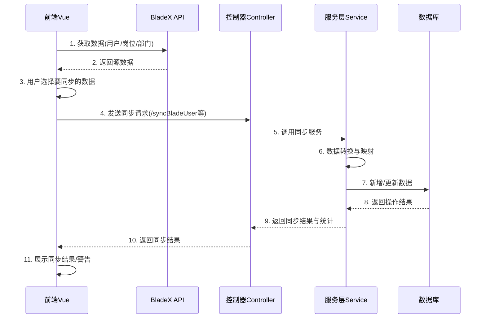

# BladeX与若依系统数据同步流程文档

## 目录

1. [概述](#概述)
2. [系统架构](#系统架构)
3. [数据流程图](#数据流程图)
4. [用户数据同步](#用户数据同步)
5. [岗位数据同步](#岗位数据同步)
6. [部门数据同步](#部门数据同步)
7. [数据映射关系](#数据映射关系)
8. [错误处理机制](#错误处理机制)
9. [优化建议](#优化建议)

## 概述

本文档详细说明BladeX与若依系统之间的数据同步流程，包括用户、岗位和部门三种核心数据的同步机制。两个系统采用不同的数据结构和编码规范，因此同步过程中需要进行数据转换和映射。

## 系统架构

### 前端架构

前端同步功能主要在`apiTest/index.vue`组件中实现，采用以下技术栈：
- Vue 2 + ElementUI组件库
- Axios进行API调用
- 自定义API封装（`/src/api/blade/apiTest.js`）

### 后端架构

后端同步功能由以下组件实现：
- 控制器层：`SysUserController`、`SysPostController`、`SysDeptController`
- 服务层：`SysUserServiceImpl`、`SysPostServiceImpl`、`SysDeptServiceImpl`
- 数据访问层：MyBatis Mapper接口和XML映射文件

## 数据流程图



## 用户数据同步

### 前端流程

1. **数据获取**：通过`getUserList`方法从BladeX API获取用户数据
2. **用户选择**：在表格界面选择需要同步的用户
3. **发起同步**：调用`handleSyncUsers`方法处理同步逻辑

```javascript
// 处理表格选择变化
handleSelectionChange(selection) {
  this.userSelection = selection;
},

// 同步用户数据到若依系统
handleSyncUsers() {
  if (!this.userSelection || this.userSelection.length === 0) {
    this.$message.error('请至少选择一个用户进行同步');
    return;
  }
  
  this.$modal.confirm('确定要同步选中的用户数据到系统中吗？').then(() => {
    this.userSyncLoading = true;
    
    const userList = this.userSelection.map(item => {
      // 转换为若依需要的格式
      return {
        id: item.id,
        account: item.account,
        realName: item.realName,
        email: item.email,
        phone: item.phone,
        avatar: item.avatar,
        sex: item.sex,
        deptId: item.deptId,
        postId: item.postId,
        postCode: item.postCode,
        status: item.status,
        isDeleted: item.isDeleted
      };
    });
    
    syncBladeUserToRuoyi(userList).then(response => {
      // ...处理响应
    }).catch(() => {
      // ...处理错误
    });
  });
}
```

### 后端流程

1. **接收数据**：`SysUserController.syncBladeUser`方法接收用户数据列表
2. **服务调用**：控制器将数据传递给`userService.syncBladeUser`方法处理
3. **数据处理**：服务层进行如下操作：
   - 解析BladeX用户数据（账号、姓名、邮箱等）
   - 转换状态值和性别值（BladeX与若依系统的枚举值不同）
   - 检查用户是否已存在，决定新增或更新
   - 处理用户与岗位的关联关系
4. **结果返回**：返回包含统计信息和警告信息的结果字符串

```java
@Override
@Transactional
public String syncBladeUser(List<Map<String, Object>> bladeUserList) {
    // ...初始化和参数检查
    
    for (Map<String, Object> bladeUser : bladeUserList) {
        try {
            // 解析BladeX用户数据
            String id = getStringValue(bladeUser, "id");
            String account = getStringValue(bladeUser, "account");
            // ...其他字段解析
            
            // 状态转换: BladeX的1→若依的0(正常)，其他→1(停用)
            String status = "0";
            Object statusObj = bladeUser.get("status");
            if (statusObj != null) {
                int statusValue = ((Number) statusObj).intValue();
                status = (statusValue == 1) ? "0" : "1";
            }
            
            // 性别转换: BladeX(1=男,2=女,-1=未知)→若依(0=男,1=女,2=未知)
            if (sex != null) {
                switch (sex) {
                    case "1": sex = "0"; break; // 男
                    case "2": sex = "1"; break; // 女
                    default: sex = "2"; break;  // 未知
                }
            }
            
            // 创建用户对象
            SysUser sysUser = new SysUser();
            sysUser.setUserId(userId);
            sysUser.setUserName(account);
            // ...设置其他字段
            
            // 检查用户是否已存在并进行相应处理
            SysUser existUser = userMapper.selectUserById(userId);
            if (existUser != null) {
                // 更新现有用户
                // ...
            } else {
                // 新增用户
                // ...
            }
            
            // 处理岗位关联
            syncUserPost(sysUser, bladeUser, postCodeMap);
        } catch (Exception e) {
            // 异常处理和警告收集
        }
    }
    
    // 构建结果信息
    return resultMsg.toString();
}
```

## 岗位数据同步

### 前端流程

1. **数据获取**：通过`getPostList`方法从BladeX API获取岗位数据
2. **用户选择**：在表格界面选择需要同步的岗位
3. **发起同步**：调用`handleSyncPosts`方法处理同步逻辑

```javascript
// 处理岗位表格选择变化
handlePostSelectionChange(selection) {
  this.postSelection = selection;
},

// 同步岗位数据到若依系统
handleSyncPosts() {
  if (!this.postSelection || this.postSelection.length === 0) {
    this.$message.error('请至少选择一个岗位进行同步');
    return;
  }
  
  this.$confirm('确认将选中的BladeX岗位数据同步到若依系统吗？...').then(() => {
    this.postSyncLoading = true;
    // ...同步逻辑
    syncBladePostToRuoyi(this.postSelection).then(response => {
      // ...处理响应
    }).catch(error => {
      // ...处理错误
    });
  });
}
```

### 后端流程

1. **接收数据**：`SysPostController.syncBladePost`方法接收岗位数据列表
2. **服务调用**：控制器将数据传递给`postService.syncBladePost`方法处理
3. **数据处理**：服务层进行如下操作：
   - 获取现有岗位映射（ID和编码）
   - 解析BladeX岗位数据
   - 转换岗位类型，添加到若依系统的备注字段
   - 根据岗位编码确定更新或新增操作
4. **结果返回**：返回包含统计信息的结果字符串

```java
@Override
@Transactional
public String syncBladePost(List<Map<String, Object>> bladePostList) {
    // ...初始化和参数检查
    
    for (Map<String, Object> bladePost : bladePostList) {
        try {
            // 解析BladeX岗位数据
            String id = getStringValue(bladePost, "id");
            String postName = getStringValue(bladePost, "postName");
            String postCode = getStringValue(bladePost, "postCode");
            // ...其他字段解析
            
            // 岗位类别转换并作为备注
            String remark = "";
            Object categoryObj = bladePost.get("category");
            if (categoryObj != null) {
                int category = ((Number) categoryObj).intValue();
                switch (category) {
                    case 1: remark = "岗位类型：高层"; break;
                    case 2: remark = "岗位类型：中层"; break;
                    case 3: remark = "岗位类型：基层"; break;
                    case 4: remark = "岗位类型：其他"; break;
                }
            }
            
            // 创建岗位对象
            SysPost sysPost = new SysPost();
            sysPost.setPostId(postId);
            sysPost.setPostName(postName);
            sysPost.setPostCode(postCode);
            sysPost.setPostSort(sort);
            sysPost.setStatus("0"); // 默认正常状态
            sysPost.setRemark(remark);
            
            // 检查岗位是否已存在并进行相应处理
            if (existingPostCodeMap.containsKey(postCode)) {
                // 更新现有岗位
                // ...
            } else {
                // 新增岗位
                // ...
            }
        } catch (Exception e) {
            // 异常处理和警告收集
        }
    }
    
    // 构建结果信息
    return resultMsg.toString();
}
```

## 部门数据同步

### 前端流程

部门同步与用户、岗位同步略有不同，因为部门是树形结构，前端需要保持层级关系。

1. **数据获取**：通过`getDeptList`方法从BladeX API获取部门树形数据
2. **发起同步**：调用`handleSyncDepts`方法处理同步逻辑，同步整个部门树

```javascript
// 同步部门数据到若依系统
handleSyncDepts() {
  if (!this.deptList || this.deptList.length === 0) {
    this.$message.error('没有可同步的部门数据，请先获取部门列表');
    return;
  }
  
  // 因为部门是树形结构，使用整个部门列表而不是选择
  this.$confirm('确认将BladeX的部门数据同步到若依系统吗？...').then(() => {
    this.deptSyncLoading = true;
    // ...同步逻辑
    syncBladeDeptToRuoyi(this.deptList).then(response => {
      // ...处理响应
    }).catch(error => {
      // ...处理错误
    });
  });
}
```

### 后端流程

1. **接收数据**：`SysDeptController.syncBladeDept`方法接收部门数据列表
2. **服务调用**：控制器将数据传递给`deptService.syncBladeDept`方法处理
3. **数据处理**：服务层进行如下操作：
   - 获取现有部门映射
   - 将树形结构扁平化，确保处理所有部门
   - 解析BladeX部门数据
   - 状态转换：BladeX的1→若依的0(正常)，其他→1(停用)
   - 确保正确处理部门的层级关系和祖先路径
4. **结果返回**：返回包含统计信息的结果字符串

```java
@Override
@Transactional
public String syncBladeDept(List<Map<String, Object>> bladeDeptList) {
    // ...初始化和参数检查
    
    // 先将树形结构扁平化，确保处理所有部门
    List<Map<String, Object>> flatDeptList = new ArrayList<>();
    flattenDeptTree(bladeDeptList, flatDeptList);
    
    for (Map<String, Object> bladeDept : flatDeptList) {
        try {
            // 解析BladeX部门数据
            String id = getStringValue(bladeDept, "id");
            String deptName = getStringValue(bladeDept, "deptName");
            String parentId = getStringValue(bladeDept, "parentId");
            // ...其他字段解析
            
            // 状态转换: BladeX的1→若依的0(正常)，其他→1(停用)
            String status = "0";
            Object statusObj = bladeDept.get("status");
            if (statusObj != null) {
                int statusValue = ((Number) statusObj).intValue();
                status = (statusValue == 1) ? "0" : "1";
            }
            
            // 创建部门对象
            SysDept sysDept = new SysDept();
            sysDept.setDeptId(deptId);
            sysDept.setDeptName(deptName);
            sysDept.setParentId(parentDeptId);
            // ...设置其他字段
            
            // 设置祖先路径(ancestors)，这对层级关系很重要
            if (parentDeptId != null && parentDeptId == 0) {
                // 顶级部门
                sysDept.setAncestors("0");
            } else {
                // 非顶级部门
                SysDept parentDept = existingDeptMap.get(parentDeptId);
                if (parentDept != null) {
                    sysDept.setAncestors(parentDept.getAncestors() + "," + parentDeptId);
                } else {
                    // 父部门不存在的情况
                    sysDept.setAncestors("0," + parentDeptId);
                }
            }
            
            // 检查部门是否已存在并进行相应处理
            if (existingDeptMap.containsKey(deptId)) {
                // 更新现有部门
                // ...
            } else {
                // 新增部门
                // ...
            }
        } catch (Exception e) {
            // 异常处理和警告收集
        }
    }
    
    // 构建结果信息
    return resultMsg.toString();
}
```

## 数据映射关系

### 用户数据映射

| BladeX字段 | 若依字段 | 转换规则 |
|------------|----------|----------|
| id         | userId   | 直接映射 |
| account    | userName | 直接映射 |
| realName   | nickName | 直接映射 |
| email      | email    | 直接映射 |
| phone      | phonenumber | 直接映射 |
| avatar     | avatar   | 直接映射 |
| deptId     | deptId   | 直接映射 |
| status(1)  | status(0) | BladeX的1→若依的0(正常) |
| status(其他) | status(1) | BladeX的其他值→若依的1(停用) |
| isDeleted(0) | delFlag(0) | BladeX的0→若依的0(存在) |
| isDeleted(1) | delFlag(2) | BladeX的1→若依的2(删除) |
| sex(1)     | sex(0)   | BladeX的1→若依的0(男) |
| sex(2)     | sex(1)   | BladeX的2→若依的1(女) |
| sex(其他)  | sex(2)   | BladeX的其他值→若依的2(未知) |

### 岗位数据映射

| BladeX字段 | 若依字段 | 转换规则 |
|------------|----------|----------|
| id         | postId   | 直接映射 |
| postCode   | postCode | 直接映射 |
| postName   | postName | 直接映射 |
| sort       | postSort | 直接映射 |
| category(1) | remark   | "岗位类型：高层" |
| category(2) | remark   | "岗位类型：中层" |
| category(3) | remark   | "岗位类型：基层" |
| category(4) | remark   | "岗位类型：其他" |
| -          | status   | 默认"0"(正常) |

### 部门数据映射

| BladeX字段 | 若依字段 | 转换规则 |
|------------|----------|----------|
| id         | deptId   | 直接映射 |
| parentId   | parentId | 直接映射 |
| deptName   | deptName | 直接映射 |
| fullName   | leader   | 直接映射(若依用leader存储全称) |
| sort       | orderNum | 直接映射 |
| status(1)  | status(0) | BladeX的1→若依的0(正常) |
| status(其他) | status(1) | BladeX的其他值→若依的1(停用) |
| -          | ancestors | 根据parentId构建(如"0,100,101") |

## 错误处理机制

### 前端错误处理

前端对所有同步操作采用统一的错误处理机制：

1. **请求错误**：捕获网络请求异常，根据错误类型(响应错误/请求失败/配置错误)提供适当反馈
2. **结果处理**：根据返回结果类型区分处理方式：
   - 包含警告信息：使用HTML格式弹窗详细展示
   - 无警告正常结果：使用简洁成功提示

### 后端错误处理

后端采用以下错误处理策略：

1. **全局事务**：所有同步方法都使用`@Transactional`注解，确保数据一致性
2. **异常捕获**：对每个实体处理使用`try-catch`，记录错误但不中断整体流程
3. **警告收集**：使用`StringBuilder`收集各类警告信息，并在结果中返回
4. **日志记录**：对关键步骤和异常使用详细日志记录

## 优化建议

1. **增量同步**：目前实现是全量同步，可考虑增加增量同步机制，基于时间戳或版本号
2. **批量处理**：大量数据同步时，可考虑批量处理，减少数据库压力
3. **ID映射表**：建议维护一张ID映射表，便于跟踪BladeX与若依系统的ID对应关系
4. **数据校验**：增强前后端数据校验，特别是针对必填字段和数据格式
5. **同步日志**：添加同步操作日志表，记录每次同步的详细信息，便于问题排查
6. **自动调度**：考虑增加定时任务，实现系统间数据自动同步 