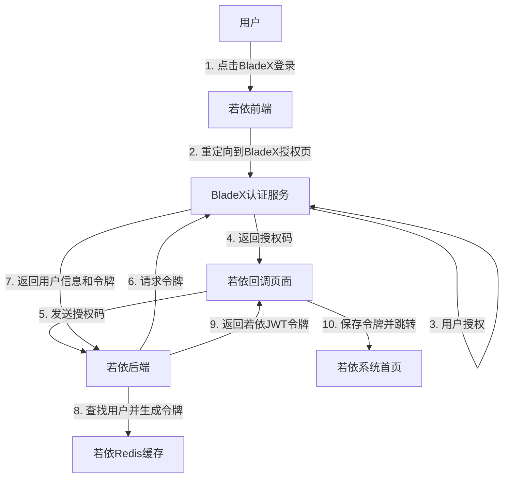

# BladeX单点登录与若依框架集成实现文档

## 1. 概述

本文档详细介绍了将BladeX认证系统与若依(RuoYi)框架集成的完整实现过程。集成采用OAuth2.0授权码流程，使用户能够通过BladeX账号直接登录若依系统，实现无缝单点登录体验。

## 2. 系统架构

### 2.1 总体架构



### 2.2 关键组件

- **BladeAuthUtil**: 工具类，处理与BladeX认证服务的通信
- **BladeAuthController**: 后端控制器，处理授权码并生成若依JWT令牌
- **BladeCallback.vue**: 前端页面，接收授权回调并处理认证结果

## 3. 后端实现

### 3.1 BladeAuthUtil工具类

```java
public class BladeAuthUtil {
    public static Map<String, Object> getTokenByCode(String authUrl, String clientId, 
                                                    String clientSecret, String code, 
                                                    String redirectUri, String tenantId) {
        // 构建请求参数
        MultiValueMap<String, String> params = new LinkedMultiValueMap<>();
        params.add("grant_type", "authorization_code");
        params.add("code", code);
        params.add("client_id", clientId);
        params.add("client_secret", clientSecret);
        params.add("redirect_uri", redirectUri);
        
        if (tenantId != null && !tenantId.isEmpty()) {
            params.add("tenant_id", tenantId);
        }
        
        // 发送请求获取令牌
        try {
            RestTemplate restTemplate = new RestTemplate();
            HttpHeaders headers = new HttpHeaders();
            headers.setContentType(MediaType.APPLICATION_FORM_URLENCODED);
            
            HttpEntity<MultiValueMap<String, String>> requestEntity = new HttpEntity<>(params, headers);
            ResponseEntity<Map> response = restTemplate.exchange(authUrl, HttpMethod.POST, 
                                                               requestEntity, Map.class);
            
            return response.getBody();
        } catch (Exception e) {
            // 处理异常
            return null;
        }
    }
}
```

### 3.2 BladeAuthController控制器

```java
@RestController
@RequestMapping("/blade/auth")
public class BladeAuthController {
    @Value("${blade.auth.url:}")
    private String authUrl;
    
    @Value("${blade.auth.client-id:}")
    private String clientId;
    
    @Value("${blade.auth.client-secret:}")
    private String clientSecret;
    
    @Value("${blade.auth.redirect-uri:}")
    private String redirectUri;
    
    @Autowired
    private ISysUserService userService;
    
    @Autowired
    private TokenService tokenService;
    
    @Autowired
    private UserDetailsServiceImpl userDetailsService;
    
    @GetMapping("/getTokenInfo")
    public AjaxResult getTokenInfo(@RequestParam("code") String code, 
                               @RequestParam(value = "tenant_id", required = false) String tenantId) {
        // 获取BladeX令牌
        Map<String, Object> tokenInfo = BladeAuthUtil.getTokenByCode(
            authUrl, clientId, clientSecret, code, redirectUri, tenantId);
        
        // 提取用户名并查找若依系统用户
        if (tokenInfo != null && tokenInfo.containsKey("account")) {
            String userName = (String) tokenInfo.get("account");
            SysUser user = userService.selectUserByUserName(userName);
            
            if (user != null) {
                // 使用UserDetailsServiceImpl创建LoginUser对象
                LoginUser loginUser = (LoginUser) userDetailsService.createLoginUser(user);
                
                // 记录登录信息
                recordLoginInfo(user.getUserId());
                
                // 使用TokenService生成JWT令牌
                String token = tokenService.createToken(loginUser);
                
                // 返回令牌
                AjaxResult ajax = AjaxResult.success();
                ajax.put(Constants.TOKEN, token);
                return ajax;
            }
        }
        
        return AjaxResult.error("认证失败");
    }
}
```

## 4. 前端实现

### 4.1 登录页面增加BladeX登录按钮

```vue
<template>
  <div class="login">
    <!-- 现有登录表单 -->
    
    <!-- 添加BladeX登录按钮 -->
    <el-button type="primary" class="blade-login-btn" @click="handleBladeLogin">
      使用BladeX登录
    </el-button>
  </div>
</template>

<script>
export default {
  methods: {
    handleBladeLogin() {
      // BladeX授权页面URL
      const bladeAuthUrl = process.env.VUE_APP_BLADE_AUTH_URL;
      const clientId = process.env.VUE_APP_BLADE_CLIENT_ID;
      const redirectUri = encodeURIComponent(process.env.VUE_APP_BLADE_REDIRECT_URI);
      
      // 跳转到BladeX授权页面
      window.location.href = `${bladeAuthUrl}?client_id=${clientId}&response_type=code&redirect_uri=${redirectUri}`;
    }
  }
}
</script>
```

### 4.2 BladeCallback.vue回调处理页面

```vue
<template>
  <div class="blade-callback-container">
    <div class="callback-card">
      <div v-if="loading">
        <h2>正在处理BladeX授权...</h2>
        <el-progress :percentage="progress"></el-progress>
      </div>
      <div v-else-if="error">
        <h2>授权处理失败</h2>
        <p>{{ errorMessage }}</p>
        <el-button type="primary" @click="returnToLogin">返回登录页</el-button>
      </div>
    </div>
  </div>
</template>

<script>
import { Message } from 'element-ui';
import { setToken } from '@/utils/auth';

export default {
  data() {
    return {
      loading: true,
      error: false,
      errorMessage: '',
      code: '',
      tenantId: ''
    };
  },
  created() {
    // 获取URL参数中的授权码
    this.code = this.$route.query.code;
    this.tenantId = this.$route.query.state || '';
    
    // 处理授权码
    this.handleAuthorizationCode();
  },
  methods: {
    // 处理授权码
    handleAuthorizationCode() {
      request({
        url: '/blade/auth/getTokenInfo',
        method: 'get',
        params: {
          code: this.code,
          tenant_id: this.tenantId
        }
      }).then(response => {
        if (response.code === 200 && response.data && response.data.token) {
          // 使用若依token登录
          this.handleLoginSuccess(response.data.token);
        } else {
          // 显示错误信息
          this.handleError(response.msg || '获取令牌失败');
        }
      }).catch(error => {
        this.handleError('获取令牌失败: ' + error.message);
      });
    },
    
    // 处理登录成功
    handleLoginSuccess(token) {
      // 保存token
      setToken(token);
      
      // 获取用户信息并生成路由
      this.$store.dispatch('GetInfo').then(() => {
        this.$store.dispatch('GenerateRoutes').then(accessRoutes => {
          // 动态添加可访问路由表
          this.$router.addRoutes(accessRoutes);
          
          // 跳转到首页
          this.$router.push({ path: '/' });
        });
      });
    }
  }
};
</script>
```

## 5. 配置说明

### 5.1 后端配置 (application.yml)

```yaml
# BladeX认证配置
blade:
  auth:
    # BladeX认证服务地址
    url: https://auth.example.com/oauth/token
    # 客户端ID
    client-id: your_client_id
    # 客户端密钥
    client-secret: your_client_secret
    # 重定向URI
    redirect-uri: http://your-app-url/auth/blade-callback
```

### 5.2 前端配置 (.env.development)

```
# BladeX配置
VUE_APP_BLADE_AUTH_URL=https://auth.example.com/oauth/authorize
VUE_APP_BLADE_CLIENT_ID=your_client_id
VUE_APP_BLADE_REDIRECT_URI=http://your-app-url/auth/blade-callback
```

### 5.3 安全配置

在`SecurityConfig.java`中添加允许匿名访问的路径：

```java
@Override
protected void configure(HttpSecurity httpSecurity) throws Exception {
    httpSecurity
        // 其他配置
        .antMatchers(
            "/blade/auth/getTokenInfo",
            // 其他允许匿名访问的路径
        ).permitAll()
}
```

## 6. 实现步骤

### 6.1 前置准备

1. 向BladeX系统管理员申请OAuth2.0客户端ID和密钥
2. 确认并配置授权回调URL
3. 确保若依系统中存在与BladeX用户名相匹配的账号

### 6.2 后端实现步骤

1. 创建BladeAuthUtil工具类
2. 实现BladeAuthController控制器
3. 在application.yml中添加BladeX配置
4. 更新SecurityConfig安全配置

### 6.3 前端实现步骤

1. 在登录页添加BladeX登录按钮
2. 创建回调处理页面BladeCallback.vue
3. 配置前端环境变量
4. 更新路由配置，添加回调页面路由

### 6.4 路由配置

在前端路由配置中添加BladeX回调页面：

```javascript
// router/index.js
export const constantRoutes = [
  // 其他路由
  {
    path: '/auth/blade-callback',
    component: () => import('@/views/auth/BladeCallback'),
    hidden: true
  }
]
```

## 7. 集成测试

### 7.1 测试流程

1. 点击BladeX登录按钮，验证是否正确重定向到BladeX授权页面
2. 在BladeX系统完成登录授权
3. 验证是否正确重定向回若依系统
4. 检查是否成功获取若依JWT令牌
5. 验证是否成功进入若依系统首页
6. 测试若依系统的各项功能是否正常

### 7.2 故障排查

1. 检查浏览器控制台日志
2. 查看后端日志输出
3. 使用开发者工具检查网络请求
4. 验证Redis中是否成功缓存了登录用户信息

## 8. 安全与性能考虑

### 8.1 安全

- 确保client_secret不被暴露在前端代码中
- 实现CSRF防护
- 设置合理的token过期时间
- 考虑实现单点登出功能

### 8.2 性能

- 缓存用户权限信息
- 考虑多Redis节点的情况下的token共享
- 优化前端资源加载

## 9. 常见问题与解决方案

### 9.1 回调地址配置问题

**问题**：BladeX系统报错"重定向URI不匹配"

**解决方案**：确保在BladeX系统注册的重定向URI与application.yml和前端环境变量中配置的完全一致，包括协议、域名、端口和路径。

### 9.2 无法获取用户信息

**问题**：获取到BladeX令牌但无法获取用户信息

**解决方案**：检查请求参数是否正确，特别是client_id和client_secret，并确认BladeX用户账号是否有效。

### 9.3 若依系统找不到对应用户

**问题**：BladeX认证成功但若依系统找不到对应用户

**解决方案**：确保在若依系统中创建与BladeX用户名相匹配的账号，或实现自动创建用户的功能。

## 10. 结论

通过本文档介绍的方法，成功实现了BladeX单点登录与若依框架的无缝集成，用户可以使用BladeX账号直接登录若依系统，享受到统一认证的便利性。集成过程充分利用了若依现有的登录机制，最小化了代码修改，确保了系统的稳定性和安全性。

本集成方案具有以下优势：
- 完全复用若依原生登录流程的后半部分，确保与系统其他部分的一致性
- 令牌格式、存储、过期机制与原生系统保持一致
- 最小化修改，降低集成风险
- BladeX用户享有与普通登录用户相同的体验


