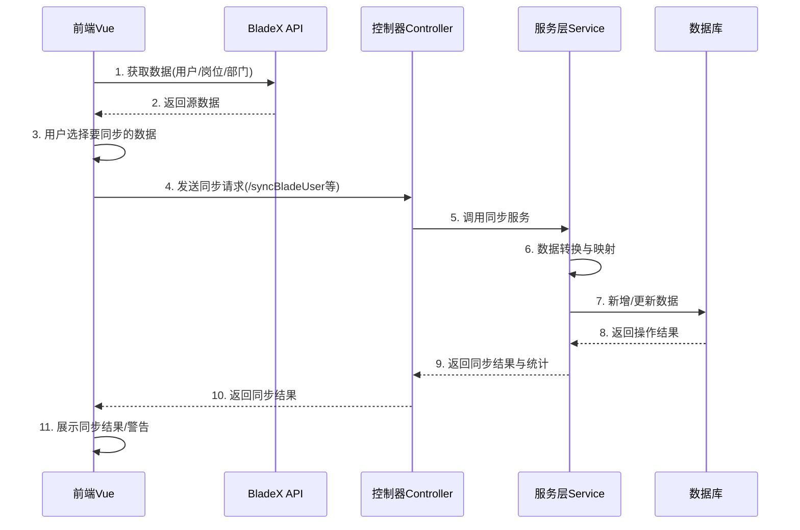

# 若依框架与BladeX的用户、部门、岗位设计同步方案汇总

## 目录

1. [概述](#概述)
2. [系统架构](#系统架构)
3. [数据流程图](#数据流程图)
4. [用户数据同步](#用户数据同步)
5. [岗位数据同步](#岗位数据同步)
6. [部门数据同步](#部门数据同步)
7. [数据映射关系](#数据映射关系)
8. [错误处理机制](#错误处理机制)
9. [优化建议](#优化建议)

## 一、若依框架中的用户-岗位-部门设计


### 1.1 部门(SysDept)
部门是组织架构的基本单位，采用树形结构设计：

- **主要字段**：
  - `dept_id`：部门ID，主键
  - `parent_id`：父部门ID，表示上级部门关系
  - `ancestors`：祖级列表，存储所有上级部门ID，用逗号分隔
  - `dept_name`：部门名称
  - `order_num`：显示顺序
  - `leader`：负责人
  - `phone`：联系电话
  - `email`：邮箱
  - `status`：部门状态（0正常 1停用）
  - `del_flag`：删除标志

- **特点**：
  - 树形结构，支持无限级部门
  - 通过`ancestors`字段优化树形查询性能
  - 支持部门状态控制

### 1.2 岗位(SysPost)
岗位是人员在组织中的职责定位：

- **主要字段**：
  - `post_id`：岗位ID，主键
  - `post_code`：岗位编码
  - `post_name`：岗位名称
  - `post_sort`：岗位排序
  - `status`：状态（0正常 1停用）
  - `create_by/create_time`：创建者/创建时间
  - `update_by/update_time`：更新者/更新时间
  - `remark`：备注

- **特点**：
  - 支持岗位编码，便于与外部系统对接
  - 可灵活定义多种岗位类型

### 1.3 用户(SysUser)
用户是系统操作的主体：

- **主要字段**：
  - `user_id`：用户ID，主键
  - `dept_id`：部门ID，关联部门表
  - `user_name`：用户账号
  - `nick_name`：用户昵称
  - `email`：用户邮箱
  - `user_type`: 用户类型
  - `phonenumber`：手机号码
  - `sex`：用户性别
  - `avatar`：头像路径
  - `password`：密码
  - `status`：帐号状态（0正常 1停用）
  - `del_flag`：删除标志
  - `login_ip/login_date`：最后登录IP/时间

- **特点**：
  - 一个用户只能属于一个部门
  - 支持账号状态控制

### 1.4 用户-岗位关联(SysUserPost)
用户和岗位是多对多关系，通过中间表关联：

- **主要字段**：
  - `user_id`：用户ID
  - `post_id`：岗位ID

- **特点**：
  - 一个用户可以担任多个岗位
  - 一个岗位可以有多个用户

### 1.5 关系设计

```
┌────────┐      ┌─────────┐      ┌────────┐
│ SysUser│──1─┐ │SysUserPost│  ┌─│SysPost │
└────────┘    └─│          │──┘  └────────┘
     │           └─────────┘         
     │                             
     │                             
  n  │                             
     │                             
     ▼                             
┌────────┐                        
│SysDept │                        
└────────┘                        
```

- 用户与部门：一对多关系（一个用户只属于一个部门，一个部门可以有多个用户）
- 用户与岗位：多对多关系（通过用户-岗位关联表实现）
- 部门与岗位：无直接关联，通过用户间接关联

### 1.6 数据权限设计

若依基于这套组织架构实现了灵活的数据权限控制：

- 全部数据权限
- 自定义数据权限
- 部门数据权限
- 部门及以下数据权限
- 仅本人数据权限

这种设计使得系统可以根据用户的部门和角色，控制其能够访问的数据范围。

若依框架的用户-岗位-部门设计既实用又灵活，可以满足大多数企业的组织架构需求，同时为权限控制提供了良好的基础。

## 二、BladeX框架中的用户-岗位-部门设计


### 2.1 部门(Dept)
BladeX中的部门也是采用树形结构设计：

- **主要字段**：
  - `id`：部门ID，主键
  - `parent_id`：父部门ID
  - `ancestors`：祖级部门IDs
  - `dept_name`: 部门类型
  - `dept_name`：部门名称
  - `full_name`：部门全称
  - `sort`：排序
  - `remark`：备注
  - `is_deleted`：逻辑删除标识
  - `tenant_id`：租户ID

- **特点**：
  - 支持多租户设计，每个部门都有租户ID
  - 与若依类似的树形结构设计
  - 增加了全称字段，方便展示完整部门路径

### 2.2 岗位(Post)
BladeX的岗位设计：

- **主要字段**：
  - `id`：岗位ID
  - `category`：岗位类型
  - `post_code`：岗位编码
  - `post_name`：岗位名称
  - `sort`：排序
  - `remark`：备注
  - `is_deleted`：逻辑删除标识
  - `tenant_id`：租户ID

- **特点**：
  - 岗位设计中增加了岗位类型(category)字段
  - 支持多租户，有租户ID字段
  - 保留了岗位编码设计，有利于与其他系统对接

### 2.3 用户(User)
BladeX的用户设计比若依更加丰富：

- **主要字段**：
  - `id`：用户ID
  - `tenant_id`：租户ID
  - `code`：用户编号
  - `user_type`：用户类型(web,app等)
  - `account`：账号
  - `name`：姓名
  - `real_name`：真实姓名
  - `avatar`：头像
  - `email`：电子邮件
  - `phone`：手机
  - `birthday`：生日
  - `sex`：性别
  - `role_id`：角色ID
  - `dept_id`：部门ID
  - `post_id`：岗位ID
  - `status`：状态
  - `is_deleted`：逻辑删除

## 三、BladeX与若依系统数据同步流程

### 3.1 概述

本文档详细说明BladeX与若依系统之间的数据同步流程，包括用户、岗位和部门三种核心数据的同步机制。两个系统采用不同的数据结构和编码规范，因此同步过程中需要进行数据转换和映射。

### 3.2 系统架构

#### 3.2.1 前端架构

前端同步功能主要在`apiTest/index.vue`组件中实现，采用以下技术栈：
- Vue 2 + ElementUI组件库
- Axios进行API调用
- 自定义API封装（`/src/api/blade/apiTest.js`）

#### 3.2.2 后端架构

后端同步功能由以下组件实现：
- 控制器层：`SysUserController`、`SysPostController`、`SysDeptController`
- 服务层：`SysUserServiceImpl`、`SysPostServiceImpl`、`SysDeptServiceImpl`
- 数据访问层：MyBatis Mapper接口和XML映射文件

### 3.3 数据流程图



### 3.4 用户数据同步

#### 3.4.1 前端流程

1. **数据获取**：通过`getUserList`方法从BladeX API获取用户数据
2. **用户选择**：在表格界面选择需要同步的用户
3. **发起同步**：调用`handleSyncUsers`方法处理同步逻辑

```javascript
// 处理表格选择变化
handleSelectionChange(selection) {
  this.userSelection = selection;
},

// 同步用户数据到若依系统
handleSyncUsers() {
  if (!this.userSelection || this.userSelection.length === 0) {
    this.$message.error('请至少选择一个用户进行同步');
    return;
  }
  
  this.$modal.confirm('确定要同步选中的用户数据到系统中吗？').then(() => {
    this.userSyncLoading = true;
    
    const userList = this.userSelection.map(item => {
      // 转换为若依需要的格式
      return {
        id: item.id,
        account: item.account,
        realName: item.realName,
        email: item.email,
        phone: item.phone,
        avatar: item.avatar,
        sex: item.sex,
        deptId: item.deptId,
        postId: item.postId,
        postCode: item.postCode,
        status: item.status,
        isDeleted: item.isDeleted
      };
    });
    
    syncBladeUserToRuoyi(userList).then(response => {
      // ...处理响应
    }).catch(() => {
      // ...处理错误
    });
  });
}
```

#### 3.4.2 后端流程

1. **接收数据**：`SysUserController.syncBladeUser`方法接收用户数据列表
2. **服务调用**：控制器将数据传递给`userService.syncBladeUser`方法处理
3. **数据处理**：服务层进行如下操作：
   - 解析BladeX用户数据（账号、姓名、邮箱等）
   - 转换状态值和性别值（BladeX与若依系统的枚举值不同）
   - 检查用户是否已存在，决定新增或更新
   - 处理用户与岗位的关联关系
4. **结果返回**：返回包含统计信息和警告信息的结果字符串

```java
@Override
@Transactional
public String syncBladeUser(List<Map<String, Object>> bladeUserList) {
    // ...初始化和参数检查
    
    for (Map<String, Object> bladeUser : bladeUserList) {
        try {
            // 解析BladeX用户数据
            String id = getStringValue(bladeUser, "id");
            String account = getStringValue(bladeUser, "account");
            // ...其他字段解析
            
            // 状态转换: BladeX的1→若依的0(正常)，其他→1(停用)
            String status = "0";
            Object statusObj = bladeUser.get("status");
            if (statusObj != null) {
                int statusValue = ((Number) statusObj).intValue();
                status = (statusValue == 1) ? "0" : "1";
            }
            
            // 性别转换: BladeX(1=男,2=女,-1=未知)→若依(0=男,1=女,2=未知)
            if (sex != null) {
                switch (sex) {
                    case "1": sex = "0"; break; // 男
                    case "2": sex = "1"; break; // 女
                    default: sex = "2"; break;  // 未知
                }
            }
            
            // 创建用户对象
            SysUser sysUser = new SysUser();
            sysUser.setUserId(userId);
            sysUser.setUserName(account);
            // ...设置其他字段
            
            // 检查用户是否已存在并进行相应处理
            SysUser existUser = userMapper.selectUserById(userId);
            if (existUser != null) {
                // 更新现有用户
                // ...
            } else {
                // 新增用户
                // ...
            }
            
            // 处理岗位关联
            syncUserPost(sysUser, bladeUser, postCodeMap);
        } catch (Exception e) {
            // 异常处理和警告收集
        }
    }
    
    // 构建结果信息
    return resultMsg.toString();
}
```

### 3.5 岗位数据同步

#### 3.5.1 前端流程

1. **数据获取**：通过`getPostList`方法从BladeX API获取岗位数据
2. **用户选择**：在表格界面选择需要同步的岗位
3. **发起同步**：调用`handleSyncPosts`方法处理同步逻辑

```javascript
// 处理岗位表格选择变化
handlePostSelectionChange(selection) {
  this.postSelection = selection;
},

// 同步岗位数据到若依系统
handleSyncPosts() {
  if (!this.postSelection || this.postSelection.length === 0) {
    this.$message.error('请至少选择一个岗位进行同步');
    return;
  }
  
  this.$confirm('确认将选中的BladeX岗位数据同步到若依系统吗？...').then(() => {
    this.postSyncLoading = true;
    // ...同步逻辑
    syncBladePostToRuoyi(this.postSelection).then(response => {
      // ...处理响应
    }).catch(error => {
      // ...处理错误
    });
  });
}
```

#### 3.5.2 后端流程

1. **接收数据**：`SysPostController.syncBladePost`方法接收岗位数据列表
2. **服务调用**：控制器将数据传递给`postService.syncBladePost`方法处理
3. **数据处理**：服务层进行如下操作：
   - 获取现有岗位映射（ID和编码）
   - 解析BladeX岗位数据
   - 转换岗位类型，添加到若依系统的备注字段
   - 根据岗位编码确定更新或新增操作
4. **结果返回**：返回包含统计信息的结果字符串

```java
@Override
@Transactional
public String syncBladePost(List<Map<String, Object>> bladePostList) {
    // ...初始化和参数检查
    
    for (Map<String, Object> bladePost : bladePostList) {
        try {
            // 解析BladeX岗位数据
            String id = getStringValue(bladePost, "id");
            String postName = getStringValue(bladePost, "postName");
            String postCode = getStringValue(bladePost, "postCode");
            // ...其他字段解析
            
            // 岗位类别转换并作为备注
            String remark = "";
            Object categoryObj = bladePost.get("category");
            if (categoryObj != null) {
                int category = ((Number) categoryObj).intValue();
                switch (category) {
                    case 1: remark = "岗位类型：高层"; break;
                    case 2: remark = "岗位类型：中层"; break;
                    case 3: remark = "岗位类型：基层"; break;
                    case 4: remark = "岗位类型：其他"; break;
                }
            }
            
            // 创建岗位对象
            SysPost sysPost = new SysPost();
            sysPost.setPostId(postId);
            sysPost.setPostName(postName);
            sysPost.setPostCode(postCode);
            sysPost.setPostSort(sort);
            sysPost.setStatus("0"); // 默认正常状态
            sysPost.setRemark(remark);
            
            // 检查岗位是否已存在并进行相应处理
            if (existingPostCodeMap.containsKey(postCode)) {
                // 更新现有岗位
                // ...
            } else {
                // 新增岗位
                // ...
            }
        } catch (Exception e) {
            // 异常处理和警告收集
        }
    }
    
    // 构建结果信息
    return resultMsg.toString();
}
```

### 3.6 部门数据同步

#### 3.6.1 前端流程

部门同步与用户、岗位同步略有不同，因为部门是树形结构，前端需要保持层级关系。

1. **数据获取**：通过`getDeptList`方法从BladeX API获取部门树形数据
2. **发起同步**：调用`handleSyncDepts`方法处理同步逻辑，同步整个部门树

```javascript
// 同步部门数据到若依系统
handleSyncDepts() {
  if (!this.deptList || this.deptList.length === 0) {
    this.$message.error('没有可同步的部门数据，请先获取部门列表');
    return;
  }
  
  // 因为部门是树形结构，使用整个部门列表而不是选择
  this.$confirm('确认将BladeX的部门数据同步到若依系统吗？...').then(() => {
    this.deptSyncLoading = true;
    // ...同步逻辑
    syncBladeDeptToRuoyi(this.deptList).then(response => {
      // ...处理响应
    }).catch(error => {
      // ...处理错误
    });
  });
}
```

#### 3.6.2 后端流程

1. **接收数据**：`SysDeptController.syncBladeDept`方法接收部门数据列表
2. **服务调用**：控制器将数据传递给`deptService.syncBladeDept`方法处理
3. **数据处理**：服务层进行如下操作：
   - 获取现有部门映射
   - 将树形结构扁平化，确保处理所有部门
   - 解析BladeX部门数据
   - 状态转换：BladeX的1→若依的0(正常)，其他→1(停用)
   - 确保正确处理部门的层级关系和祖先路径
4. **结果返回**：返回包含统计信息的结果字符串

```java
@Override
@Transactional
public String syncBladeDept(List<Map<String, Object>> bladeDeptList) {
    // ...初始化和参数检查
    
    // 先将树形结构扁平化，确保处理所有部门
    List<Map<String, Object>> flatDeptList = new ArrayList<>();
    flattenDeptTree(bladeDeptList, flatDeptList);
    
    for (Map<String, Object> bladeDept : flatDeptList) {
        try {
            // 解析BladeX部门数据
            String id = getStringValue(bladeDept, "id");
            String deptName = getStringValue(bladeDept, "deptName");
            String parentId = getStringValue(bladeDept, "parentId");
            // ...其他字段解析
            
            // 状态转换: BladeX的1→若依的0(正常)，其他→1(停用)
            String status = "0";
            Object statusObj = bladeDept.get("status");
            if (statusObj != null) {
                int statusValue = ((Number) statusObj).intValue();
                status = (statusValue == 1) ? "0" : "1";
            }
            
            // 创建部门对象
            SysDept sysDept = new SysDept();
            sysDept.setDeptId(deptId);
            sysDept.setDeptName(deptName);
            sysDept.setParentId(parentDeptId);
            // ...设置其他字段
            
            // 设置祖先路径(ancestors)，这对层级关系很重要
            if (parentDeptId != null && parentDeptId == 0) {
                // 顶级部门
                sysDept.setAncestors("0");
            } else {
                // 非顶级部门
                SysDept parentDept = existingDeptMap.get(parentDeptId);
                if (parentDept != null) {
                    sysDept.setAncestors(parentDept.getAncestors() + "," + parentDeptId);
                } else {
                    // 父部门不存在的情况
                    sysDept.setAncestors("0," + parentDeptId);
                }
            }
            
            // 检查部门是否已存在并进行相应处理
            if (existingDeptMap.containsKey(deptId)) {
                // 更新现有部门
                // ...
            } else {
                // 新增部门
                // ...
            }
        } catch (Exception e) {
            // 异常处理和警告收集
        }
    }
    
    // 构建结果信息
    return resultMsg.toString();
}
```

## 四、数据映射关系

### 4.1 用户数据映射

| BladeX字段 | 若依字段 | 转换规则 |
|------------|----------|----------|
| id         | userId   | 直接映射 |
| account    | userName | 直接映射 |
| realName   | nickName | 直接映射 |
| email      | email    | 直接映射 |
| phone      | phonenumber | 直接映射 |
| avatar     | avatar   | 直接映射 |
| deptId     | deptId   | 直接映射 |
| status(1)  | status(0) | BladeX的1→若依的0(正常) |
| status(其他) | status(1) | BladeX的其他值→若依的1(停用) |
| isDeleted(0) | delFlag(0) | BladeX的0→若依的0(存在) |
| isDeleted(1) | delFlag(2) | BladeX的1→若依的2(删除) |
| sex(1)     | sex(0)   | BladeX的1→若依的0(男) |
| sex(2)     | sex(1)   | BladeX的2→若依的1(女) |
| sex(其他)  | sex(2)   | BladeX的其他值→若依的2(未知) |

### 4.2 岗位数据映射

| BladeX字段 | 若依字段 | 转换规则 |
|------------|----------|----------|
| id         | postId   | 直接映射 |
| postCode   | postCode | 直接映射 |
| postName   | postName | 直接映射 |
| sort       | postSort | 直接映射 |
| category(1) | remark   | "岗位类型：高层" |
| category(2) | remark   | "岗位类型：中层" |
| category(3) | remark   | "岗位类型：基层" |
| category(4) | remark   | "岗位类型：其他" |
| -          | status   | 默认"0"(正常) |

### 4.3 部门数据映射

| BladeX字段 | 若依字段 | 转换规则 |
|------------|----------|----------|
| id         | deptId   | 直接映射 |
| parentId   | parentId | 直接映射 |
| deptName   | deptName | 直接映射 |
| fullName   | leader   | 直接映射(若依用leader存储全称) |
| sort       | orderNum | 直接映射 |
| status(1)  | status(0) | BladeX的1→若依的0(正常) |
| status(其他) | status(1) | BladeX的其他值→若依的1(停用) |
| -          | ancestors | 根据parentId构建(如"0,100,101") |

### 4.4 用户-岗位关系同步处理

#### 主要差异：
- BladeX中post_id字段直接存在于用户表中
- 若依使用SysUserPost关联表实现多对多关系

#### 处理方案：
1. 从BladeX用户表中获取用户ID和岗位ID
2. 为每个用户-岗位对创建SysUserPost记录
3. 如果BladeX中一个用户只能有一个岗位，则直接1:1映射

## 五、错误处理机制

### 5.1 前端错误处理

前端对所有同步操作采用统一的错误处理机制：

1. **请求错误处理**：
   - 捕获网络请求异常，根据错误类型(响应错误/请求失败/配置错误)提供适当反馈
   - 针对连接超时或服务器错误，提供友好的错误提示和重试选项
   - 记录错误信息到前端控制台，方便开发人员排查问题

2. **结果处理**：
   - 包含警告信息：使用HTML格式弹窗详细展示警告内容，突出显示关键信息
   - 无警告正常结果：使用简洁成功提示
   - 针对部分成功情况：展示成功数量和失败数量，并提供失败详情查看选项

3. **部门树展示问题处理**：
   - 在树选择组件中添加normalizer函数，确保ID一致性处理
   - 递归处理部门树数据，统一将所有ID转为字符串类型
   - 修复treeselect组件无法正确选择同步部门的问题
   ```javascript
   // 处理部门树数据，确保ID为字符串类型
   processDeptOptions(depts) {
     if (!depts) return [];
     return depts.map(dept => {
       dept.id = String(dept.id);
       if (dept.children && dept.children.length) {
         dept.children = this.processDeptOptions(dept.children);
       }
       return dept;
     });
   }
   ```

4. **分页组件类型错误处理**：
   - 确保后端返回的数值类型数据在前端正确转换
   - 对分页组件的total属性进行Number()显式转换
   ```javascript
   // 确保分页数据类型正确
   getList() {
     this.loading = true;
     listUser(this.queryParams).then(response => {
       this.userList = response.rows;
       this.total = Number(response.total); // 确保total为数字类型
       this.loading = false;
     });
   }
   ```

### 5.2 后端错误处理

后端采用以下错误处理策略：

1. **全局事务管理**：
   - 所有同步方法都使用`@Transactional`注解，确保数据一致性
   - 针对部分失败情况，提供单独事务处理，避免全部回滚
   - 实现细粒度的事务隔离，确保单个实体处理失败不影响其他实体

2. **异常捕获与处理**：
   - 对每个实体处理使用`try-catch`，记录错误但不中断整体流程
   - 分类处理不同类型异常，提供针对性的错误信息
   - 记录详细的异常堆栈信息，方便问题排查

3. **ID精度丢失问题处理**：
   - 添加专门的ID转换处理方法，确保大整数ID不会丢失精度
   ```java
   /**
    * 安全转换ID，避免精度丢失
    * @param value 原始ID值
    * @return 转换后的Long类型ID
    */
   private Long convertId(Object value) {
       if (value == null) {
           return null;
       }
       try {
           if (value instanceof Long) {
               return (Long) value;
           } else if (value instanceof Integer) {
               return ((Integer) value).longValue();
           } else if (value instanceof String) {
               // 使用BigDecimal作为中间转换类型，确保精度不丢失
               return new BigDecimal((String) value).longValue();
           } else if (value instanceof BigDecimal) {
               return ((BigDecimal) value).longValue();
           } else if (value instanceof Number) {
               return ((Number) value).longValue();
           }
           // 其他类型尝试转为字符串再转换
           return new BigDecimal(value.toString()).longValue();
       } catch (Exception e) {
           log.error("ID转换失败，原始值: {}, 错误: {}", value, e.getMessage());
           throw new RuntimeException("ID转换失败: " + value, e);
       }
   }
   ```

4. **Long类型序列化处理**：
   - 配置Jackson将Long类型序列化为字符串，避免前端精度丢失
   ```java
   @Configuration
   public class JacksonConfig {
       @Bean
       public ObjectMapper jacksonObjectMapper(Jackson2ObjectMapperBuilder builder) {
           ObjectMapper objectMapper = builder.createXmlMapper(false).build();
           SimpleModule simpleModule = new SimpleModule();
           // Long类型序列化为字符串
           simpleModule.addSerializer(Long.class, ToStringSerializer.instance);
           simpleModule.addSerializer(Long.TYPE, ToStringSerializer.instance);
           objectMapper.registerModule(simpleModule);
           return objectMapper;
       }
   }
   ```

5. **警告和错误信息收集**：
   - 使用`StringBuilder`收集各类警告信息，并在结果中返回
   - 实现更精细的错误分类，区分严重错误和普通警告
   - 结构化错误信息，便于前端展示和处理

6. **日志记录完善**：
   - 对关键步骤和异常使用详细日志记录
   - 添加操作上下文信息，包括操作用户、时间和来源
   - 实现分级日志记录，便于筛选和分析问题

7. **空值和异常情况处理**：
   - 完善部门父子关系处理，处理父部门不存在的情况
   - 增强ID值为null或无效情况的处理逻辑
   - 增加类型安全的值获取方法，避免类型转换异常

## 六、优化建议

1. **增量同步**：目前实现是全量同步，可考虑增加增量同步机制，基于时间戳或版本号
2. **批量处理**：大量数据同步时，可考虑批量处理，减少数据库压力
3. **ID映射表**：建议维护一张ID映射表，便于跟踪BladeX与若依系统的ID对应关系
4. **数据校验**：增强前后端数据校验，特别是针对必填字段和数据格式
5. **同步日志**：添加同步操作日志表，记录每次同步的详细信息，便于问题排查
6. **自动调度**：考虑增加定时任务，实现系统间数据自动同步 