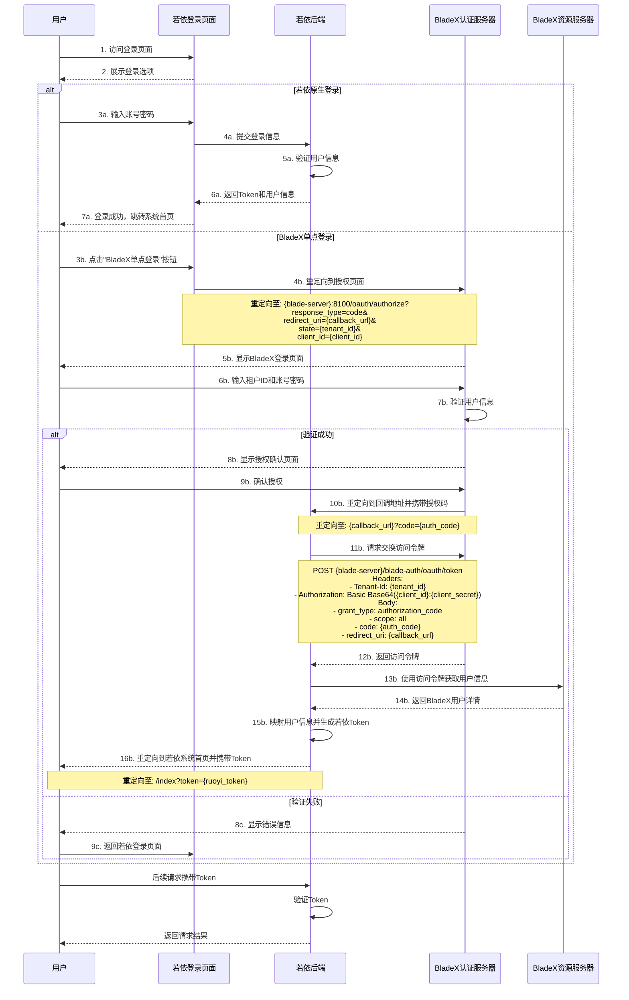
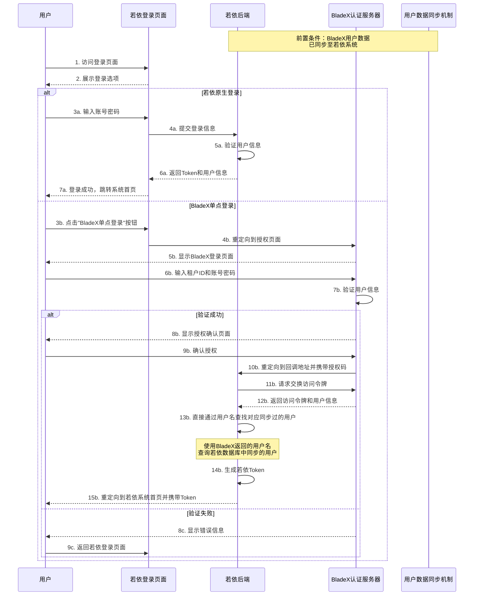

# 若依框架与SpringBlade单点登录集成方案

## 框架概述

### 若依框架(RuoYi)
- 基于SpringBoot的轻量级权限管理系统
- 使用Spring Security管理权限认证
- 采用经典单体架构设计
- 支持多种认证方式

### SpringBlade(BladeX)
- 基于SpringCloud的微服务架构
- 使用OAuth2协议进行统一认证
- 支持多租户架构
- 提供Nacos配置中心与注册中心

## 单点登录集成方案

### 方案设计

1. 在若依登录页面添加"单点登录"按钮
2. 点击后通过OAuth2授权码模式跳转到BladeX认证页面
3. 完成认证后重定向回若依系统并自动登录

### 实现步骤

1. **修改若依登录页面，添加单点登录选项**

```html
<!-- ... existing code ... -->
<div class="other-login">
  <el-divider>
    <span class="login-tip">其他登录方式</span>
  </el-divider>
  <div class="other-login-item">
    <el-button type="primary" @click="handleSSOLogin">BladeX单点登录</el-button>
  </div>
</div>
<!-- ... existing code ... -->
```

2. **实现登录页面的SSO跳转逻辑**

```javascript
methods: {
  // ... existing code ...
  
  handleSSOLogin() {
    // 构建授权请求URL
    const authUrl = `${process.env.VUE_APP_BLADE_AUTH_URL}/oauth/authorize?` +
      `response_type=code&` +
      `redirect_uri=${encodeURIComponent(process.env.VUE_APP_SSO_CALLBACK_URL)}&` +
      `state=${this.tenantId || '000000'}&` +
      `client_id=${process.env.VUE_APP_BLADE_CLIENT_ID}`;
    
    // 跳转到授权页面
    window.location.href = authUrl;
  }
}
```

3. **在若依系统中创建OAuth回调控制器**

```java
@RestController
@RequestMapping("/auth/callback")
public class OAuthCallbackController {
    
    @Autowired
    private SSOService ssoService;
    
    @GetMapping("/blade")
    public void handleBladeCallback(
            HttpServletRequest request, 
            HttpServletResponse response,
            @RequestParam("code") String code,
            @RequestParam(value = "state", required = false) String tenantId) throws IOException {
        
        // 使用授权码获取令牌
        SSOUserInfo userInfo = ssoService.getBladeUserInfo(code, tenantId);
        
        // 使用BladeX用户信息在若依系统中进行登录
        String token = ssoService.loginWithBladeUser(userInfo);
        
        // 重定向到若依系统首页，带上登录令牌
        response.sendRedirect("/index?token=" + token);
    }
}
```

4. **实现SSO服务，处理授权码换取令牌和用户登录**

```java
@Service
public class SSOServiceImpl implements SSOService {
    
    @Value("${blade.auth.url}")
    private String bladeAuthUrl;
    
    @Value("${blade.client.id}")
    private String clientId;
    
    @Value("${blade.client.secret}")
    private String clientSecret;
    
    @Value("${blade.redirect-uri}")
    private String redirectUri;
    
    @Autowired
    private TokenService tokenService;
    
    @Autowired
    private RestTemplate restTemplate;
    
    @Override
    public SSOUserInfo getBladeUserInfo(String code, String tenantId) {
        // 构建获取令牌的请求
        HttpHeaders headers = new HttpHeaders();
        headers.setContentType(MediaType.APPLICATION_FORM_URLENCODED);
        headers.set("Tenant-Id", tenantId != null ? tenantId : "000000");
        headers.set("Authorization", "Basic " + 
                Base64.getEncoder().encodeToString((clientId + ":" + clientSecret).getBytes()));
        
        MultiValueMap<String, String> params = new LinkedMultiValueMap<>();
        params.add("grant_type", "authorization_code");
        params.add("scope", "all");
        params.add("code", code);
        params.add("redirect_uri", redirectUri);
        
        HttpEntity<MultiValueMap<String, String>> request = new HttpEntity<>(params, headers);
        
        // 发送请求获取令牌
        ResponseEntity<Map> tokenResponse = restTemplate.postForEntity(
                bladeAuthUrl + "/oauth/token", 
                request, 
                Map.class);
        
        String accessToken = (String) tokenResponse.getBody().get("access_token");
        
        // 使用令牌获取用户信息
        HttpHeaders userInfoHeaders = new HttpHeaders();
        userInfoHeaders.set("Authorization", "Bearer " + accessToken);
        userInfoHeaders.set("Tenant-Id", tenantId != null ? tenantId : "000000");
        
        HttpEntity<Void> userInfoRequest = new HttpEntity<>(userInfoHeaders);
        
        ResponseEntity<SSOUserInfo> userInfoResponse = restTemplate.exchange(
                bladeAuthUrl + "/blade-auth/oauth/user-info",
                HttpMethod.GET,
                userInfoRequest,
                SSOUserInfo.class);
        
        return userInfoResponse.getBody();
    }
    
    @Override
    public String loginWithBladeUser(SSOUserInfo bladeUser) {
        // 在若依系统中查找或创建对应的用户
        // 这里需要根据实际情况实现用户映射逻辑
        SysUser user = mapBladeUserToRuoYiUser(bladeUser);
        
        // 使用若依的TokenService生成令牌
        LoginUser loginUser = new LoginUser(
                user.getUserId(),
                user.getDeptId(),
                user,
                permissionService.getMenuPermission(user)
        );
        
        // 生成token
        return tokenService.createToken(loginUser);
    }
    
    private SysUser mapBladeUserToRuoYiUser(SSOUserInfo bladeUser) {
        // 根据BladeX用户ID或用户名查找若依系统中的用户
        // 如果不存在，可以选择自动创建
        // 这里需要根据实际业务逻辑实现
        // ...
    }
}
```

5. **配置应用属性**

在若依的`application.yml`或`application-dev.yml`中添加BladeX相关配置：

```yaml
# BladeX单点登录配置
blade:
  auth:
    url: http://blade-server-ip:8100
  client:
    id: ruoyi-client
    secret: ruoyi-secret
  redirect-uri: http://ruoyi-server-ip:port/auth/callback/blade
```

6. **在BladeX系统中配置客户端信息**

在BladeX的`blade_client`表中添加配置：

```sql
INSERT INTO `blade_client` (
  `client_id`, 
  `client_secret`, 
  `resource_ids`,
  `scope`,
  `authorized_grant_types`,
  `web_server_redirect_uri`,
  `authorities`,
  `access_token_validity`,
  `refresh_token_validity`,
  `additional_information`,
  `autoapprove`,
  `create_user`,
  `create_dept`,
  `create_time`,
  `update_user`,
  `update_time`,
  `status`,
  `is_deleted`
) VALUES (
  'ruoyi-client',
  'ruoyi-secret',
  NULL,
  'all',
  'authorization_code,refresh_token',
  'http://ruoyi-server-ip:port/auth/callback/blade',
  NULL,
  3600,
  604800,
  NULL,
  'true',
  1,
  1,
  NOW(),
  1,
  NOW(),
  1,
  0
);
```

## 系统兼容性说明

1. 保留若依原登录入口，不影响原登录流程
2. 单点登录为可选功能，用户可根据需要选择登录方式
3. 用户账号可在两个系统间进行映射，保证数据一致性

## 注意事项

1. 确保BladeX使用8100端口暴露授权服务
2. 需要确保两个系统的用户体系有合理的映射关系
3. 跨域和安全性问题需要妥善处理
4. 推荐使用HTTPS加密所有认证交互


# 若依框架与SpringBlade单点登录集成流程图

以下是单点登录集成方案的验证流程图，重点展示了登录鉴权部分：



## 核心验证流程说明

### 1. 若依原生登录流程
- 用户输入账号密码
- 若依系统验证身份
- 生成Token并返回给前端
- 前端保存Token并跳转至首页

### 2. BladeX单点登录流程
- **授权请求阶段**
  - 用户点击"BladeX单点登录"按钮
  - 前端构建授权请求URL并重定向
  - BladeX认证服务器展示登录页面
  - 用户输入租户ID和账户信息

- **授权码获取阶段**
  - BladeX验证用户身份
  - 展示授权确认页面
  - 用户确认授权后，BladeX生成授权码
  - 重定向到若依系统回调地址，携带授权码

- **令牌交换阶段**
  - 若依后端接收授权码
  - 向BladeX认证服务器发送令牌交换请求
  - 获取访问令牌(access_token)

- **用户信息获取与映射阶段**
  - 使用访问令牌从BladeX获取用户详情
  - 将BladeX用户信息映射到若依用户体系
  - 生成若依系统的Token
  - 重定向到若依首页，完成单点登录

### 3. 后续请求验证
- 所有后续请求都携带若依Token
- 若依后端验证Token有效性
- 根据Token识别用户身份和权限

此流程保证了两套系统的用户体系能够无缝集成，并允许用户通过BladeX认证直接登录若依系统，同时保留了原有登录机制的完整性。


# 基于用户同步的若依与BladeX单点登录优化方案

既然若依系统的用户数据已由BladeX系统同步过来，单点登录方案可以更加简化和高效。下面是优化后的设计方案和流程图：

## 优化后的单点登录流程图



## 优化方案说明

### 1. 用户匹配简化

由于用户数据已经从BladeX同步到若依系统，不再需要复杂的用户映射逻辑。可以直接通过用户名或用户标识符找到对应的若依系统用户。

```java
@Service
public class SSOServiceImpl implements SSOService {
    
    @Autowired
    private SysUserService userService;
    
    @Autowired
    private TokenService tokenService;
    
    @Override
    public String loginWithBladeUser(SSOUserInfo bladeUser) {
        // 直接根据用户名查找同步过来的用户
        SysUser user = userService.selectUserByUserName(bladeUser.getUsername());
        
        if (user == null) {
            throw new ServiceException("用户未同步，请联系管理员");
        }
        
        // 使用若依的TokenService生成令牌
        LoginUser loginUser = new LoginUser(
                user.getUserId(),
                user.getDeptId(),
                user,
                permissionService.getMenuPermission(user)
        );
        
        // 生成token
        return tokenService.createToken(loginUser);
    }
}
```

### 2. 回调控制器优化

```java
@RestController
@RequestMapping("/auth/callback")
public class OAuthCallbackController {
    
    @Autowired
    private SSOService ssoService;
    
    @GetMapping("/blade")
    public void handleBladeCallback(
            HttpServletRequest request, 
            HttpServletResponse response,
            @RequestParam("code") String code,
            @RequestParam(value = "state", required = false) String tenantId) throws IOException {
        
        // 使用授权码获取令牌和用户信息
        SSOUserInfo userInfo = ssoService.getBladeUserInfo(code, tenantId);
        
        try {
            // 直接使用同步过的用户进行登录
            String token = ssoService.loginWithBladeUser(userInfo);
            // 重定向到若依系统首页，带上登录令牌
            response.sendRedirect("/index?token=" + token);
        } catch (ServiceException e) {
            // 处理用户未同步的情况
            response.sendRedirect("/login?error=" + URLEncoder.encode(e.getMessage(), "UTF-8"));
        }
    }
}
```

### 3. 用户同步状态检查

为确保单点登录系统的稳定性，可添加用户同步状态检查逻辑：

```java
@Service
public class UserSyncStatusService {

    @Autowired
    private SysUserService userService;
    
    /**
     * 检查BladeX用户是否已同步到若依系统
     */
    public boolean isUserSynced(String username) {
        SysUser user = userService.selectUserByUserName(username);
        return user != null;
    }
    
    /**
     * 获取上次同步时间
     */
    public Date getLastSyncTime() {
        // 实现获取上次同步时间的逻辑
        // 可以从某个配置表或记录表中获取
        return ...;
    }
}
```

### 4. 前端登录页优化

可以根据用户同步状态决定是否显示BladeX单点登录选项：

```javascript
export default {
  data() {
    return {
      showBladeSSO: true,
      // ... 其他数据
    };
  },
  
  created() {
    // 检查用户同步状态，决定是否显示BladeX单点登录选项
    this.checkUserSyncStatus();
  },
  
  methods: {
    async checkUserSyncStatus() {
      try {
        const res = await getUserSyncStatus();
        this.showBladeSSO = res.data.syncEnabled && res.data.lastSyncTime;
      } catch (error) {
        console.error("获取用户同步状态失败", error);
        this.showBladeSSO = false;
      }
    },
    
    // ... 其他方法
  }
}
```

## 实施建议

1. **确保用户同步机制稳定**：定期检查BladeX到若依的用户同步是否正常进行，确保用户数据一致性。

2. **添加同步状态监控**：实现一个管理页面，显示用户同步状态、上次同步时间等信息。

3. **处理同步异常**：当发现用户在BladeX存在但尚未同步到若依时，可以：
   - 提示用户等待同步完成
   - 提供手动触发同步的选项（限管理员）
   - 记录日志以便排查问题

4. **优化用户体验**：如果同步有延迟，可以在单点登录失败时提供清晰的错误信息，引导用户使用若依原生登录方式。

5. **双向同步考虑**：如果若依系统也可能创建用户，考虑实现双向同步机制。

这种基于用户同步的单点登录方案简化了实现复杂度，减少了用户映射的潜在错误，同时保持了两个系统之间的一致性。
